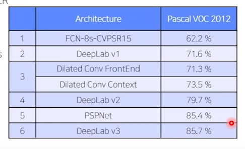

# '성수행 2호선 열차' Daily Note

## 2021.04.27
* 원승재
  - 원래 cutmix에 대해서 실험하려고 했으나 당장 코드보고 적용이 어려워서 일단 베이스라인 코드 익히고 실험 돌려봄
  - Resize(256), HorizontalFlip, RandomRotate90, VerticalFlip 총 4가지 적용해서 베이스라인 모델로 실험 진행
  - Normalize 적용해보려고 했으나, cv2로 출력했을 떄 이미지가 제대로 보이지 않아서 내일 같이 얘기해 볼 예정. 아마 학습할 땐 지장이 없고 cv2 출력 문제일 거라 생각됨
* 윤석진
  - 다른 annotation인데 image_id와 category_id가 같은 경우 : 한 사진에 똑같은 종류의 여러 객체가 존재하는 경우
  - 한 annotation의 segmentation 리스트 안의 리스트가 여럿인 경우 : 하나의 객체가 앞의 또다른 객체에 의해 가려져 segmentation상 둘 이상으로 보이는 경우
  - 자세한 설명과 사진 자료는 SeokJin 폴더에 올림, 그 외에 베이스라인 코드를 이해함, visual code의 플롯을 파일로 저장할 때 pdf로 저장하면 왜 안 열리는지, 바로 로컬에 저장하면 왜 파일이 안 생기는지 모르겠다.
* 이민우
  - Efficientunet-b7 으로 실험. CLAHE, Input shape resize를 진행해보았으나 성능은 내려감.
  - 그런데 시각적으로는 CLAHE를 사용했을 때 객체를 보다 잘 검출해내고 Loss도 보다 많이 떨어짐. epoch 조절이 필요할 것으로 예상.
  - 자세한 사항은 MWLee/실험.txt에 작성
* 조범경
  - deeplab v1으로 daily 미션 부분 작성, 실행해봄. 매끄럽지 못한 부분 있었지만 mIoU 점수 0.3452 인걸 보니 잘 돌아가기는 한듯...?  
  - 학습시간이 FCN보다 훨씬 길었던 것을 감안하면 비용대비 결과는 후진걸로....
* 최길희
  - 속도가 너무 느려서 수렴이 빠른 AdamP를 쓰고 epoch를 줄이려고 실험해봄 -> 성능 낮음=실패
  - 속도 느린걸 해결하려고 256*256 으로 이미지 resize -> 성능은 떨어지나 시간은 1/3로 떨어짐
  - 256*2556 성능 올려보려고 lr_scheduler 써봄 -> 더 떨어짐 = 실패
  - 256*256의 이미지에서 전처리 실험
    + HorizontalFlip, VerticalFlip, RandomRotate90 : 성능 오름
    + MotionBlur, OpticalDisortion, GaussNoise : 성능이 크게 오름
    + 날씨 Effect들(RandomRain, RandomSnow, RandomSunFlare, RandomFog) : 애매함
    + Color 관련 (RGBShift, HueSaturationValue, ChannelShuffle) : LB에서 확인은 못했지만 Validation 성능 오름
* 황훈
  - 시도
    + 26일 daily_mission 에서 fcn16s를 pretrain된 VGG16을 이용하여 구현하였고 학습을 돌렸다. 너무느려서 epoch은 6만 돌려주었다. 결과 : 0.3218
    + 27일 daily_mission 에서 sgenet을 완성하여 학습을 돌려보았다. epoch : 14 결과 : 0.3075
    + torchvision에서 제공해주는 segmantic segmetaion 모델 DeepLabV3_resnet50 과 resnet101을 시도해보았다. CUDA 메모리 부족 현상이 발생... 좀 더 고민해 봐야 할 것 같다.
  - pretrain된 모델을 사용하는 것이 성능이 더 좋은 것 같다. 
  - segNet 도 생각보다 너무 느리다...
## 2021.04.28
* 최길희
  - 256*256의 이미지에서 전처리 실험(이어서)
    + 밝기 관련 transform (RandomContrast, RandomGamma, RandomBrightness) : 애매
    + CLAHE : 애매 + 사용하려면 baseline code 수정 필요
    + # 전날의 transform을 모두 통합하여 사용하면 LB 0.04오름 #
  - CUDA out of memory 오류
    + transform과 관련이 없었다. 서버가 memory를 해제하지 않아 생긴 문제로 서버를 새로 생성했다.
    + 지속적으로 GPU의 memory를 모니터링하고 cache를 해제해주자!
    + batch_size 16으로 줘도 전혀 문제 없다!
  - torchvision의 fcn_resnet50 사용
    + LB : 0.4956 -> 성능이 뛰어나다
    + 토론 게시판을 참고하면 아무 transform도 하지 않았을 때 0.45나온다고 했으니 내 점수는 온전히 transform에 의해 오른 점수이다.
  - ToFloat 대신 Normalize 사용 & best model 저장 기준 mIoU로 설정
    + best model 저장 기준 mIoU로 설정 : 이건 단순히 몇번 EPOCH의 모델을 쓸지 판단하는데만 쓰이는 것이므로 모델의 성능과는 관련이 없다. 단지 이걸 쓰니 더 높은 LB의 epoch를 잘 선택한다는 것을 확인할 수 있었다.
    + ToFloat 대신 Normalize 사용 : 이전의 모델과 비교하여 성능이 올랐다.
* 이민우
  - unet 사용 포기 및 deeplabv3_resnet101 사용. 성능 많이 오름.
  - 256*256 전처리 및 Normalize 수행 => 성능 크게 오름
  - 수평, 수직, 회전으로 데이터 네 배로 증강 후 실행 => 아주 약간 오름
* 황훈
  - torchvision DeepLabV3를 학습할 떄 마다 CUDA memory오류가 났지만 해결
    + 학습 후에는 Kernel을 종료해야 CUDA memory 사용이 초기화 된다.
  - DeepLabV3Plus에 Xception모델을 backbone으로 사용하려 했지만 Xception 코드에서 dilation을 거부하여 실패하였다.
    + segmentation_models_pytorch 라는 모듈을 사용하였다.
    + 원작자 github에도 질문이 올라와 있지만 해결 방법은 아직까지 없는 것 같다.
  - DeepLabV3_ResNet50을 시도했지만 성능이 너무 낮게 나왔다.
    + dataset을 전처리하는 부분에서 픽셀 값이 커지면 계산하는데 어려움을 줄 수 있어서 255로 나누어 정규화하는 부분을 제거하고 normalize를 시도했어야 했는데 제거하지 않고 학습을 하여 성능이 낮게 나온 것으로 추정 현재 수정 후 다시 학습 시도 중.
## 2021.04.29
* 이민우
  - deeplabv3+_resnet101_32x4 사용. 성능 오름.
  - 전처리에는 변화를 주지 않음. 그대로 네 배 증강 후 랜덤 blur 작업 수행. (성능은 잘 오르지만 시간이 오래 걸림.)

* 황훈

  - 공통 setting : 
    - lr = 0.0001 
    - weight_decay = 1e-6
    - optimizer = Adam
    - loss = cross entropy
    - normalize 적용
    - seed = 21
    - Encoder weight : imagenet

  - model : DeeplabV3
     - backbone : resnet101 
     - Resize(256,256)
     - batch=24 
     - 결과 : 0.5070 

  - model : DeeplabV3Plus
     - backbone : resnet101
     - Augmentation : Resize(256,256)  
     - batch=24 
     - 0.5522

  - model : DeeplabV3Plus
     - resnet101
     - Augmentation : Resize(256,256), Horizon, VerticalFlip, RandomRotate90, MotionBlur, GaussianBlur, OpticalDistortion
     - batch=24 
     - seed=42 
     - 결과 : 0.5553

  - model : DeeplabV3Plus
     - backbone : resnet101
     - Augmentation : (Horizon, VerticalFlip, RandomRotate90, MotionBlur, GaussianBlur, OpticalDistortion)
     - batch=4
     - 결과 :  0.5027
     - 학습 Validation mIoU: 0.4954

  - model : DeeplabV3Plus
     - backbone : resnet50 
     - Augmentation :  (Horizon, VerticalFlip, RandomRotate90, MotionBlur, GaussianBlur, OpticalDistortion)
     - batch=16
     - 결과 : 0.5817

  - model : DeeplabV3Plus
     - backbone : resnext50
     - Augmentation :  (Horizon, VerticalFlip, RandomRotate90, MotionBlur, GaussianBlur, OpticalDistortion)
     - batch=16 
     - 결과 : 0.5881
     - Validation mIoU: 0.5546

  - model : U-net 
     - backbone : EfficeintNet b4
     - Augmentation :  (Horizon, VerticalFlip, RandomRotate90, MotionBlur, GaussianBlur, OpticalDistortion)
     - batch=8 
     - encoder_weight : noisy_study
     - 결과 :  0.5022 
  - model :  U-net 
     - backbone : EfficientNet b0
     - Augmentation :  (Horizon, VerticalFlip, RandomRotate90, MotionBlur, GaussianBlur, OpticalDistortion)
     - batch=16 
     - encoder_weight : noisy_study 
     - epoch=40 / 0.4757
  - 자세한 내용은 폴더안에 일지에 담겨져 있습니다.
* 최길희
  - 1)model : DeeplabV3
    + Backbone : Resnet50
    + 학습시간 : 6시간
    + mIoU : 0.5379
    + LB : 0.5781
  - 2)model : DeeplabV3Plus
    + Backbone : Resnet50
    + 학습시간 : 1시간
    + mIoU : 0.5250
    + LB : 0.5628
    + 1번 모델과의 비교 : 성능은 조금 차이나는 것에 비해 학습시간은 DeepLabV3Plus가 월등히 적게 든다
  - 3)model : Unet++
    + Backbone : Resnet50
    + 학습시간 : 3시간 13분
    + mIoU : 0.3322
    + 결론 : 쓰지마세요 쓰레깁니다
  - 4)model : DeeplabV3Plus
    + Backbone : Resnet101
    + 학습시간 : 1시간 26분
    + mIoU : 0.5227
    + LB : 0.5911
    + 결론 : 성능도 좋고 속도도 빠릅니다!이겁니다!
  - 5)model : DeeplabV3Plus
    + Backbone : resnext50_32x4d
    + 학습시간 : 1시간 30분
    + mIoU : 0.5594
    + LB : 0.5882
    + 결론 : 얘도 성능이 준수합니다. 하지만 4번 모델이 조금 더 좋군여
  - 6)model : DeeplabV3Plus
    + Backbone : densenet161
    + 결론 : densenet161도 그 오류로 사용 못합니다
  - 7)model : DeeplabV3Plus
    + Backbone : efficientnet-b0
    + 학습시간 : 2시간 30분
    + mIoU : 0.5272
    + 결론 : Efficient-b0인데도 성능이 이러면 더 높은 애들은 더 좋지 않을까 생각합니다. 단 Efficient 계열은 메모리 차지가 아주 큽니다 Batchsize 줄여야함

  *여기서 부터는 loss를 좀 바꿔봤습니다*
  - 비교용 모델
    + model : DeeplabV3Plus
    + Backbone : resnet50
    + mIoU : 0.5250
    + LB : 0.5628
    + Loss : CrossEntropyLoss
    + 사용이유 : 일단 학습시간이 빠르면서 성능도 준수해서 이걸 비교용 모델로 사용했습니다.
  - 1)FocalLoss(gamma=2)
    + model : DeeplabV3Plus
    + Backbone : resnet50
    + mIoU : 0.2548
    + Loss : FocalLoss(gamma=2)
    + 결론 : 쓰레깁니다. 단독으로 사용하지 마세요.
  - 2)CustomLoss1
    + model : DeeplabV3Plus
    + Backbone : resnet50
    + mIoU : 0.5295
    + LB : 0.5779
    + Loss : CrossEntropyLoss*0.8 + FocalLoss(gamma=2)*0.2
    + 결론 : CrossEntropy만 쓴 것보다 성능이 조금 더 올랐습니다.

## 2021.04.30

- 황훈

  1. 첫번째 - encoder 변경

     - encoder : se_resnext50_32x4d
     - encoder_weights : imagenet

     - Augmentation : Resize(256, 256), HorizonFliip, VerticalFlip, RandomRotate90, MotionBlur, GaussianBlur, OpticalDistortion
     - batch_size : 16
     - 결과 : 0.5766
     
  2. 두번째 - 새로운 Augmentation 적용
  
     - encoder : resnext50
     - batch_size : 16
     - 새로운 Augmentation 추가 : Transpose, ShiftScaleRotate, ElasticTransform
     - 결과 : 재출 횟수 1 날라감...fail.....
     
  3. 세번째 - ElasticTransform 만 적용
  
     - encoder : resnext50
     - batch_size : 16
     - epoch : 30
     - Augmentation 추가 : ElasticTransform
     - 결과 : 0.6006
     
  4. 네번째 - Augmentation 추가
     - encoder : resnext50
     - batch_size : 16
     - epoch : 40
     - Augmentation 추가 : ElasticTransform, GridDropout, GridDistortion
     - 결과 : 0.5759
     
  5. 다섯번째

     - encoder : resnext50
     - batch_size : 16
     - epoch : 40
     - Augmentation 추가 : ElasticTransform
     - loss : (cross entropy * 0.9) + (focal loss * 0.1)
     - 결과 : 0.6150
  
  6. 여섯번째
  
     - encoder : resnext50
     - batch_size : 16
     - epoch : 30
     - Augmentation 추가 : Elastic Transform, GlassBlur
     - 결과 : 0.5798
  
     
  
  7. 결과를 통해 알 수 있었던 내용 & 다음에 시도해 볼 것
  
     - 첫번째 se_resnext50모델의 경우에는 성능이 크게 나쁘지는 않았지만 모델을 불러오는 시간도 상당히 오래 걸리고 상대적으로 학습도 조금 느린 감이 없지 않아 있었습니다. 저는 resnext50을 기준으로 다양한 시도를 해볼 생각입니다.
     - ElasticTransform은 사진에 왜곡을 주는 것 같습니다. 지금까지 실험 결과 성능을 가장 많이 올려 주었습니다.
     - ElasticTransform, GridDropout, GridDistortion 3가지를 OneOf에 추가하여 활용했더니 점수가 하락했다.
     - GridDropout의 단독사용은 성능을 떨어뜨렸습니다. 기준으로 잡은 resnext50만 사용한 모델의 성능보다도 낮은 성능을 보여줍니다. 다만 Elastic Transform과 GridDropout 2개를 조합해서 실험 해볼 예정입니다.
     - GlassBlur도 성능을 하락 시켰습니다.

- 최길희
  1. 새로운 Backbone 사용
      - Efficientnet-b4
        + Batch_size : 8
        + mIoU : 0.5934
        + LB : 0.6053
        + 학습시간 : 6시간 반
        + 성능이 좋지만 시간이 너무 오래걸려서 다른 모델들로 각 기법들에 대한 실험을 진행한 후 마지막에 최종 모델 만들 때 사용하면 좋을 것 같습니다
      - Efficientnet-b7
        + Batch_size : 4
        + mIoU : 0.5575
        + 학습시간 : 21시간 반
        + Batch size가 너무 작아서인지 시간은 정말 극악같이 많이 걸렸는데 성능은 b4보다 나쁩니다. 무시하십쇼.
  2. Loss의 조합
    * 베이스 모델은 deeplabv3plus_nesnet50을 사용했습니다.
      - 1)CrossEntropyLoss
        + mIoU : 0.5250
        + LB : 0.5628
      - 2)FocalLoss(2)
        + mIoU : 0.2548 
      - 3)[CrossEntropy, focalloss(2)]=[0.8, 0.2]
        + mIoU : 0.5295
        + LB : 0.5779
      - 4)[CrossEntropy, focalloss(2)]=[0.9, 0.1]
        + mIoU : 0.5382
        + LB : 0.5829
      - 5)[CrossEntropy, focalloss(2), IoU Loss]=[0.6, 0.1, 0.3]
        + mIoU : 0.5385
        + LB : 0.5821
      - 6)[CrossEntropy, focalloss(2), IoU Loss]=[0.7, 0.1, 0.2]
        + mIoU : 0.5277
        + LB : 0.5863
      - 7)[CrossEntropy, focalloss(2), IoU Loss]=[0.8, 0.1, 0.1]
        + mIoU : 0.5255
        + LB : 0.5766
      - 8)[CrossEntropy, focalloss(2), IoU Loss, Dice Loss]=[0.5, 0.1, 0.1, 0.3]
        + mIoU : 0.5069
      - 9)[CrossEntropy, focalloss(2), IoU Loss, Dice Loss]=[0.7, 0.1, 0.1, 0.1]
        + mIoU : 0.5294
        + LB : 0.5764
      - 10)[CrossEntropy, focalloss(2), Dice Loss]=[0.7, 0.1, 0.2]
        + mIoU : 0.5250
        + LB : 0.5921
      - 11)[CrossEntropy, focalloss(2), mIoU Loss, Dice Loss, ms-ssim loss]=[0.6, 0.1, 0.1, 0.1, 0.1] 
        + mIoU : 0.5134
        + LB : 0.5873
    * 결론
      - LB 점수가 없는 케이스는 mIoU만 봐도 성능 안 나오겠구나 싶어서 제출 안한거예요.
      - Loss를 하나 단독으로 사용하는 것보단 섞어서 쓰는게 '무조건' 더 좋다.
      - 그렇다고 무조건 다 때려박는다고 최고의 성능이 나오는 것이 아니다.
      - mIoU Loss 함수와 Dice Loss 함수 분석해보면 둘이 사실상 거의 비슷한것 같습니다. 하지만 6, 10 케이스를 비교해봤을 때 둘 중 쓸거면 Dice Loss가 더 좋은 것 같습니다.
      - 아직 가장 좋은 조합을 찾아내지는 못한 상태입니다. 참고하시고 여러분도 한 번 실험해보고 결과를 공유해주시면 정말 감사!합!니!다!
      - 사용한 코드는 gilhee 폴더에 Baseline.ipynb로 올려놓겠습니다. 참고해주세요.
      - 사용법은 CustomLoss class 내부에 원하시는 Loss 종류를 init으로 때려박고 forward에서 계산되게 하시면 됩니다. weights를 인자로 받아서 계산하게 하고 싶었는데 require_grad 꼬일까봐 못하겠더라구여...
  3. 이미지 전처리 512*512에서 확인
    * 제가 사용하고 있는 Transform은 216*216 기반으로 시도했던 것일 뿐더러 LB 제출 횟수 제한으로 뇌피셜로 좋겠지 하고 쓴 것 들이라 검증을 위해 해봤습니다.
      - 비교를 위한 베이스 모델 : deeplabv3plus_resnet101_512
        + Average Loss : 0.2578
        + mIoU : 0.5227
        + LB : 0.5911 
      - 1)Weather 관련 전처리 제거 : OneOf([RandomRain, RandomSnow, RandomSunFlare, RandomFog], p=0.05)
        + Average Loss : 0.2722
        + mIoU : 0.5408
        + LB : 0.5943 
        + 큰 차이는 없지만 제거하는 것이 조금 더 좋습니다.
      - 2)Color 관련 전처리 제거 : OneOf([RGBShift, ChannelShuffle], p=0.5)
        + Average Loss : 0.2672
        + mIoU : 0.5162
        + 큰 차이는 없지만 그대로 사용하는 것이 조금 더 좋아보입니다.

## 2021.05.01

- 황훈

  - 실험

    - 앞으로의 실험의 기준점을 잡기위해서 학습시키고 검증한 모델입니다.

      - encoder : resnext50

      - epoch : 30 
      - Resize(256, 256) 추가
      - LB : 0.5784

    - 어제 실험 해봤던 cross entropy loss + focal loss를 비교해보기 위해서 다시 실험 했습니다.

      - encoder : resnext50

      - epoch : 40 
      - Resize 
      - loss=cross entropy 0.9 + focal 0.1 
      - 0.5899

    - 

      - encoder : resnext50

      - epoch : 40 
      - Loss : Label smoothing 0.1 + cross entropy 0.9 
      -  Resize  추가
      - LB : 0.5801

    - 

      - encdoer : resnext50
      - epoch=40 
      - Resize /
      - Loss : Label smoothing 0.2 + cross entropy 0.7 + focal 0.1 
      - LB :  0.5902

    - 

      - encoder : efficientnetb4
      - batch=8 
      - epoch=30 
      - Loss : Focal + Cross Entropy
      - LB :  0.6243

  - 결론 그리고 다음에 시도해 볼 것!

    - Focal Loss를 제가 찾아보고 이해한 바로는 잘 찾은 class에 대해서는 loss를 적게 주고 잘 못찾은 class에 대해서는 loss를 크게 주는 것으로 알고 있습니다. 그래서 데이터가 불균형 할 때 자주 쓰인다고 제가 이해를 하고 있습니다. 그래서 cross entropy loss와 섞어서 사용해봤습니다. ( 단독으로 사용시에는 성능이 좋지 않습니다. 실험 해봤습니다 ㅎㅎ)
    - 3번의 label smoothing loss는 모델의 과잉 확신을 방지할 수 있어 모델의 일반화 성능이 올려주는 loss로 이해 하였습니다. hard target을 soft target으로 바꿔주는 것입니다. 예를 들면 어떤 4개의 class를 예측한다고 했을 때 hard target이  [0, 1, 0, 0] 이라면 label smoothing을 실시하면 soft target [0.025, 0.925, 0,025, 0,025] 이렇게 변경해주는 loss인 것이죠. 수식을 이해하면 참 좋을텐데 수학이 약해서 그런 부분은 더 공부를 해야겠습니다...아무튼 이러한 점을 이용해서 저의 모델의 일반화 성능을 높여주기 위해서 cross entropy loss와 섞어서 사용했습니다. (물론 이것도 단독으로 사용하면 성능이 좋지 않습니다 ㅎㅎ)
    - 4번 실험에서는 3가지의 loss를 섞어서 학습 시켜봤습니다. 저도 길희님 처럼 어떤 비율이 좋다 라고는 말씀을 못드리겠습니다만 확실히 3가지를 섞어서 사용한 모델이 성능이 미미하지만 더 좋게 나왔습니다.
    - 5번째 실험은 길희님의 추천으로 efficientNet b4 를 encoder로 사용해 봤는데 성능이 아주 좋게 나왔습니다. 다만 학습속도가 너무 오래 걸려서 이걸로 실험을 하기보다는 좀 더 빠른 모델로 실험을 하고 마지막 제출하기 전에 학습해서 검증할 때 사용하려고 합니다 ㅎㅎ
    - 내일은 Dice Loss를 사용해보려고 합니다. 객체의 경계선을 잘 인식할 수 있는? 그런 loss라고 대충 이해했는데 확실히 논문 읽기가 어렵네요..혹시 제가 잘 못 이해 했다면 피어세션때 알려주시면 감사하겠습니다 ㅎㅎ

* 이민우
  - 늘 네 배로 증강시켰는데, 두 배로 증강시키는 방법이 더 좋은 성능을 냄.
  - 원본 + 변형 데이터로 실험한 결과가 좋은 성능이 남.
  - 가끔 이미지가 완전히 검은색이 되어 출력되는 현상 발견. 실험 결과 가우시안 블러 때문이었고, 제외 후 재실험 시 성능이 오름.
  - 변형 + 변형 데이터로 실험 시 어떤 결과가 나올지 실험 예정.
  
  

## 2021.05.02

- 황훈

  - 공통 setting : 
    - lr : 0.0001 
    - weight_decay : 1e-6
    - optimizer : Adam
    - seed : 21
    - batch_size : 16
    - Encoder weight : imagenet
    - model : DeepLabV3Plus
    - 기본 Augmentation : HorizonFliip, VerticalFlip, RandomRotate90, MotionBlur, GaussianBlur, OpticalDistortion, normalize, ElasticTransform, Resize(256, 256) 을 사용합니다

  1. encoder : efficientnetb4
     - batch_size : 8 
     - epoch : 40 
     - loss : Label smoothing(0.2) + cross entropy(0.7) + focal(0.1)
     - LB : 0.6243

  2. encoder : resnext50 
     - epoch : 40 
     - loss : Label smoothing(0.3) + cross entropy(0.5) + focal(0.2) 
     - LB : 0.5700

  3. encoder : resnext50 
     - epoch : 40
     - loss : cross entropy(0.9 )+ Dice(0.1)
     - LB : 0.5737

  4. encoder : resnext50
     - epoch : 40 
     - loss : Label smoothing(0.1) + cross entropy(0.8) + focal(0.1) 
     - LB : 0.5864

  5. encoder : resnext50) 
     - epoch : 40 
     -  loss : Dice(0.2) + cross entropy(0.7) + focal(0.1) 
     - LB : 0.5769

* 이민우
  - adamP 사용 시 성능이 미세하지만 더 좋아지는 현상 확인. (SGD는 별로 쓸모 없었음.)
  - 256 Resize 미사용시 성능 대폭 증가 확인.
  - 훈 님 말씀대로 배치 사이즈가 영향을 미침을 확인. => CUDA OOM이 나지 않는 선에서 2진수로 잘 맞춰줄것.

  ### 결과를 보고 난 나의 견해 & 다음에 시도해 볼 것

  - 어제 실험했던 내용 중 Label smoothing loss, Cross entropy loss, Focal loss를 2 : 7 : 1 로 섞어서 학습한 모델의 성능이 높게 나와서 efficientNet b4에도 시도해 보았다. 결과가 Focal loss 와 Cross entropy loss를 1 : 9 로 섞어서 학습한 모델과 똑같이 나왔습니다. 사실 어제 실험에서도 두개의 성능 차이가 그렇게 크지 않았습니다.
  - 2번 실험은 모델의 일반화 성능을 높여주면 모델의 전체 성능이 높아지지 않을까 싶어서 Label smoothing loss 비율을 높여서 실험했습니다.
  - 객체의 boundary를 더 잘 인식할 수 있는 Dice loss는 전반적으로 결과가 이전의 Focal loss나 Label smoothing loss를 섞어 사용한 모델들 보다 성능이 낮게 나왔습니다.
  - Label smoothing loss의 비율을 높여 일반화 성능을 올리면 모델의 성능이 좋아지지 않을까 하고 생각을 했었는데 오히려 낮아졌습니다. 그 이유에 대해서 저의 개인적인 생각으로는 Label smoothing loss는 hard target을 soft target으로 바꾸어주는데 Label smoothing loss의 비율이 높아 오히려 분류해야 하는 class의 경계가 모호해져서 잘 분류를 못하는 것이 아닐까? 하고 생각하고 있습니다. 혹시 저와 다른 견해가 있으시 거나 잘 이해하신 분이 있다면 말씀해주시면 감사하겠습니다.
  - Loss의 최적의 비율을 계속해서 실험하고 싶으나 시간을 너무 많이 소모할 것 같아서 내일 부터는 다른 실험을 해보려고 합니다. 일단 우선적으로 optimizer를 Adam에서 AdamP로 바꾸어서 학습, lr_scheduler를 이용해서 학습, 새로운 Augmentation인 GridMask를 적용해볼 예정입니다. 3가지 실험을 결과가 전부 기준보다 높게 나온다면 섞어서 사용해볼 예정입니다.
 
 -윤석진
   
   모델만 바꿔가며 동일한 조건으로 segmentation_model 전체 모델을 실험중입니다.
 
   https://github.com/bcaitech1/p3-ims-obd-line2headingseongsu/blob/master/SeokJin/210501.md 에 자세한 설명이 있습니다.
   
   다양한 모델을 실험하기 위해 8에폭만 짧게짧게 돌린 결과라, 성능은 상대적인 지표로 봐 주시면 감사하겠습니다.
   
   0.4965가 나온 timm-regnetx_064 + DeepLabV3Plus 조합은 20에폭을 돌리고 제출했을 때 0.5737, 40에폭을 돌리고 제출했을 때 0.5785가 나왔습니다.

   평소 자주쓰던 resnext50_32x4d + DeepLabV3Plus 모델의 점수 0.4633보다 더 높은 모델이 많은 것을 알 수 있습니다.
   
   상위 n개의 모델에 대하여 앙상블을 하거나, 좋은 디코더를 찾거나 할 수 있을 것 같습니다.
   
   거의 절반정도 테스트 해보았는데 학습이 될 때마다 업데이트 하겠습니다.

## 적용은 못했지만 Idea는 있다
* VGG16 대신 ResNet, EfficientNet으로 백본 교체
* 지금 Baseline Architecture는 FCN-8s인데 강의에 나온 Architecture의 성능은 다음과 같다. 더 좋은 Architecture를 사용해보는 건 어떨까?

